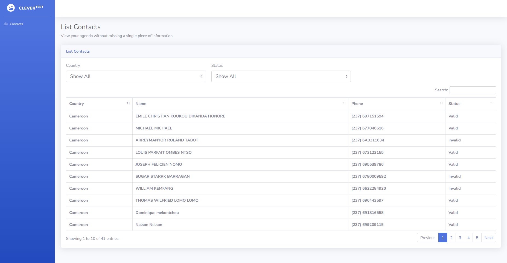
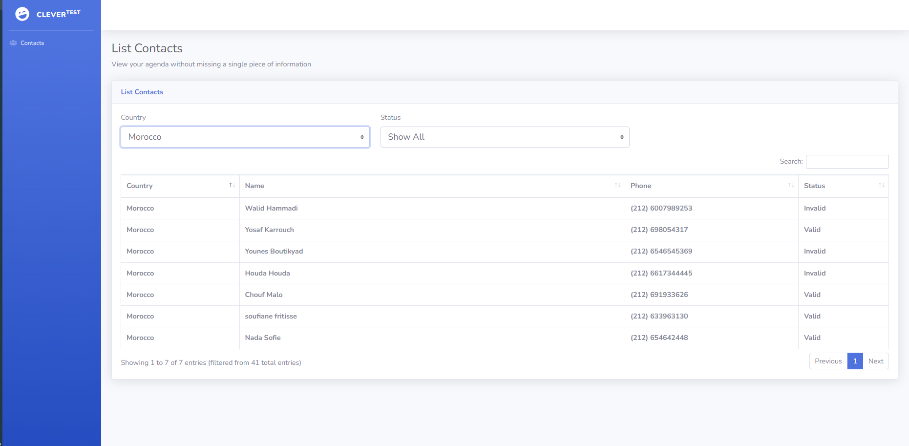
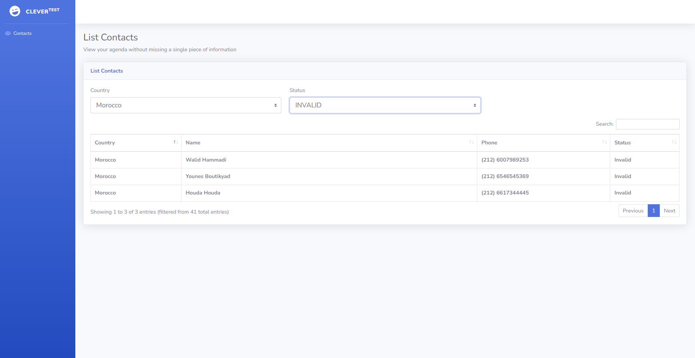

## Docker Image for CodeIgniter Clever Backend Test

This repository provides you a development environment without requiring you to install PHP, a web server, and any other server software on your local machine. For this, it requires Docker and Docker Compose.

## Build Image

create this structure:
```
CLEVERBACKEND/
    - Dockerfile
    - docker-composer.yml
    - web
    - startScript.sh
```


build the image:<br>
```
docker build . -t cleverback
```

start the container:
```
docker container run -it --publish 80:80 
```


## Installation

1. From your project directory, start up your application by running:

```sh
docker-compose up -d
```

4. From your project directory, stop your application by running:

```sh
docker-compose down --volumes
```

## Acess Website

1. In your browser, access the url below:

```sh
http://localhost
```


